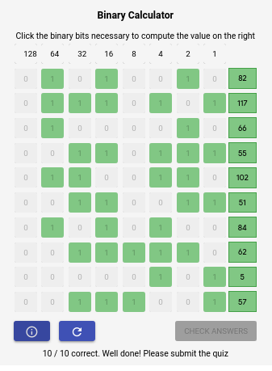

# How to Count in Binary

<br>

## Question 1

In this activity, you will use the tool below to help you convert a decimal number into binary form. When a 1 is used, we consider the value to be “ON.” When a 0 is used, we consider the value to be “OFF.”

Click the binary bits necessary to compute the decimal value on the right column. You have 10 calculations to complete.



### Some usefull script

```
>>> decimals = [82,117,66,55,102,51,84,62,5,57] # change value
>>> for num in decimals:
...     print(f"{num}: {format(num, '08b')}")
... 
82: 01010010
117: 01110101
66: 01000010
55: 00110111
102: 01100110
51: 00110011
84: 01010100
62: 00111110
5: 00000101
57: 00111001
```